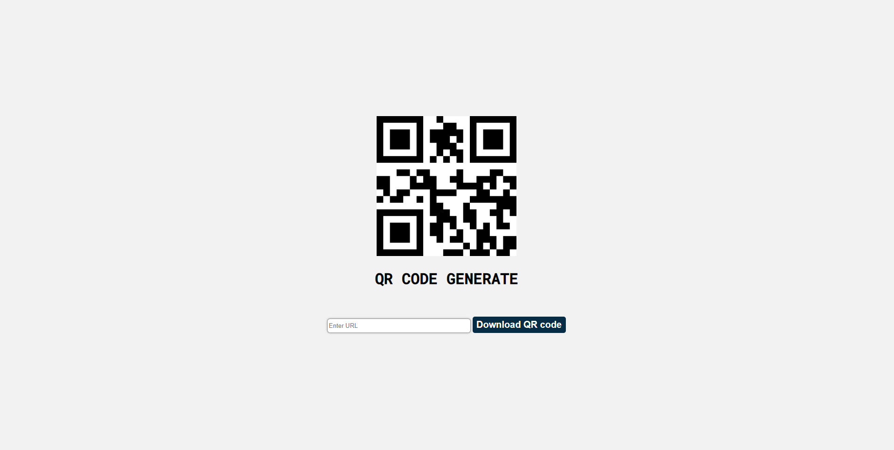

# QR Code Generator React App 

This is a simple React project for generating QR codes from URLs, developed with the purpose of assisting people in quickly generating QR codes. The application allows users to enter a URL in the input field, and upon submitting the form, the user's input is logged to the console.
 
### Table of Contents
- [How It Works](#how-it-works)
- [Installation](#installation)
- [Usage](#usage)
- [Code Structure](#code-structure)
- [License](#license)

## How It Works

The QR Code component operates in the following way:

1. **QR Code Generation:**
   - The component utilizes the `qrcode.react` library to dynamically generate QR codes based on user input.
   
2. **Reference to QRCodeCanvas:**
   - The `useRef` hook is employed to create a reference (`qrRef`) to the `QRCodeCanvas` component. This reference allows direct access to the underlying canvas element where the QR code is rendered.

3. **Download Functionality:**
   - The `downloadQRCode` function is triggered when the user clicks the "Download QR code" button.
   - Within this function:
     - It retrieves the canvas element from the `QRCodeCanvas` component using the reference.
     - Converts the QR code canvas to a PNG image.
     - Creates a temporary anchor element to facilitate the download.
     - Sets the anchor's `href` attribute to the PNG image.
     - Specifies the download filename as "qr-code.png".
     - Appends the anchor to the document body and triggers a click event.
     - Removes the anchor from the document body after the download is initiated.

This process allows users to input a URL, generate a QR code dynamically, and download the QR code as a PNG image for offline use.

## Usage
1. Enter a URL in the input field.
2. Click the "Download QR code" button to generate and download the QR code.

## Code Structure
QrCode.js: The main React component file.
style.css: Stylesheet for styling the component.

Other necessary files for the React project setup.

## Contributing
Feel free to contribute to the project by opening issues or creating pull requests.

## License
This project is licensed under the MIT License.

